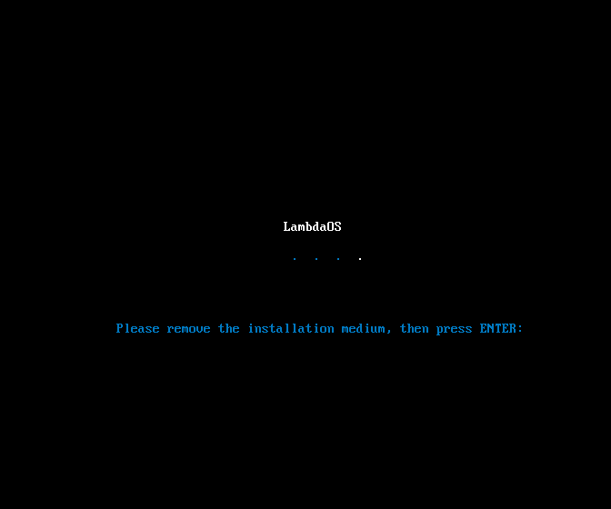

# LambdaOS

Welcome to the official LambdaOS website! LambdaOS is a sleek and modern Linux distribution based on Kubuntu, crafted to provide a smooth and polished user experience.

---

## What is LambdaOS?

LambdaOS is designed with a focus on aesthetics and efficiency. It refines the KDE Plasma desktop environment to deliver a clean, user-friendly interface without unnecessary bloat. Perfect for users who want a visually appealing and fast operating system for everyday tasks.

### Key Features:
- **Modern Design**: A sleek, visually appealing interface that enhances productivity and enjoyment.
- **Optimized Performance**: Tailored to run smoothly with efficient resource management.
- **Customizable**: Easily tweak and personalize to fit your preferences.

## Screenshots

*LambdaOS Boot Screen (May change after installation)*

## Installation

Getting LambdaOS up and running is easy! Follow these steps to install:

1. **Download the ISO**: Get the latest release from our [releases page](#).
2. **Create a Bootable USB**: Use a tool like Rufus or balenaEtcher to create a bootable USB drive.
3. **Install**: Boot from the USB and follow the on-screen instructions to install LambdaOS.

## Documentation

For detailed instructions and guides, check out our [documentation](#).

## Contribute

We welcome contributions to LambdaOS! If you want to help out, here’s how you can get involved:

- **Report Issues**: Found a bug? Let us know!
- **Submit Features**: Have a great idea? Share it with us.

## Code Contributions

1. **Download the ISO**: Get the latest version from our [releases page](https://drive.google.com/file/d/1vrZ7_jmjTdc_1lPE_mvkyO74ilKF2D6V/view?usp=sharing).
2. **Extract the Files**: Use a tool like `7-Zip` or `WinRAR` to extract the contents of the ISO.
3. **Make Your Changes**: Customize the extracted files as needed.
4. **Rebuild the ISO**: Follow our [build guide](build_guide.md) to create a new ISO file with your modifications.
5. **Submit Your Build**: Send your new ISO file to us via [email](mailto:opensystemteam1@gmail.com) for review.

Thank you for contributing!

---

Learn more about contributing on our [contributing guide](https://theosteam.github.io/projects/contributing.md).

## Contact

If you have any questions or feedback, feel free to reach out:

- **Email**: [opensystemteam1@gmail.com](mailto:opensystemteam1@gmail.com)
- **Discord**: segadreamcast.

## License

LambdaOS is licensed under the [GNU GPL license](LICENSE).

---

Thank you for visiting the LambdaOS website. We hope you enjoy using our operating system as much as we enjoyed building it!
